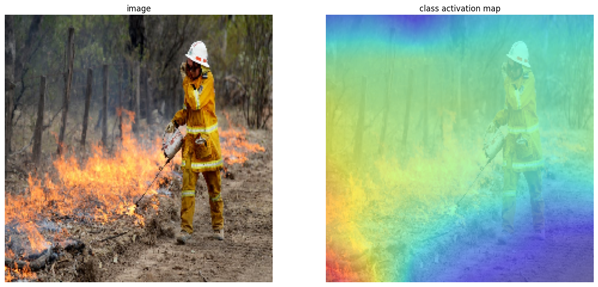

# CAM_Binary-classifier

CAM과 GradCAM을 활용한 이미지 분류, 객체 검출

   
## Object

CAM이란 CNN이 입력으로 들어온 이미지를 분류할 때 "어떤 부분을 보고" 예측을 했는지를 알려주는 역할을 합니다.

입력 이미지에 히트맵을 씌워 주어진 단어를 예측하는 데에 있어 중요한 부분에 가까워질수록 붉은 색을 띕니다.

따라서, 특정 클래스를 인식하는데 중요도를 시각화한 CAM은 딥러닝에서 이미지 분류 모델로 활용되며

본 과정에서는 이미지 분류를 시행하는 모델의 동작을 구현하는 것을 목적으로 합니다.

   
## Dataset

- find-a-car-park - https://www.kaggle.com/datasets/daggysheep/find-a-car-park
- Fire_dataset : https://www.kaggle.com/datasets/phylake1337/fire-dataset

   
## Libraries used

- numpy
- keras_ImageDataGenerator
- keras_MobileNetV2
- keras_layers_GlobalAveragePooling2D
- keras_ModelCheckpoint

   
## Version

   
## Result

